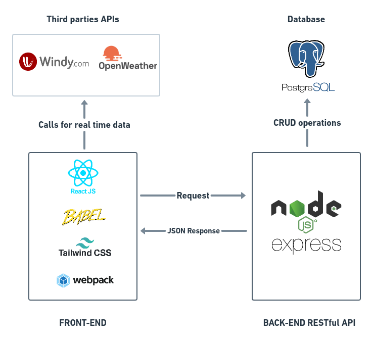
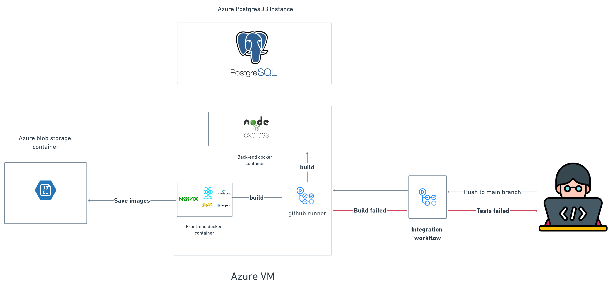

# Introduction 👋

Cabaigne is a web application developed with PERN stack, that offers tourists and local beachgoers informations related to beaches in Tunisia 
 
We provide a list of Amenities , Real time sea state (Calm, moderate or Agitated) and current weather report.

The purpose behind developing our application is to give tourists and locals a service for finding their perfect beach and therefore promote Tunisian spots and support tourism industry.

# Let's get technical 👨‍💻

## Tech Stack 🚀

## Back-End ⚙️:

### The backend server and RESTFul API : 
-   Express js web framework. 
### Database system : 
-   Postgresql. 
-   Sequelize ORM.
### User authentication :
-   JWT (JSON Web Tokens).

### Dependencies 🔗

View the complete list of Back-End dependencies in the corresponding [package.json](Backend/package.json)

| Tool/Library                                                                       | Version |
| ---------------------------------------------------------------------------------- | ------- |
| [Express js](https://expressjs.com/)                                               | ^4.18.1 |
| [Sequelize](https://sequelize.org/)                                                | ^6.21.3 |
| [node-postgres](https://www.npmjs.com/package/pg)                                  | ^8.7.3  |
| [JSON web token](https://www.npmjs.com/package/jsonwebtoken)                       | ^8.5.1  |
| [Nodemon](https://www.npmjs.com/package/nodemon)                                   | ^4.18.1 |
| [Supertest](https://www.npmjs.com/package/supertest)                               | ^1.0.0  |
| [Jest](https://jestjs.io/)                                                         | ^3.0.0  |

### Routes 🚈

- `/api/v1/beach/allbeaches`: Extract all beaches with corresponding posts(eager loading) from database.
- `/api/v1/posts/allposts`:   Extract all posts with corresponding user(eager loading) from database.
- `/api/v1/beach/newbeach`:   Add new beach to database(only accessible by admins).
- `/api/v1/uploads/azureblopuploaduser`:  Add azure image url to the corresponding user row.
- `/api/v1/uploads/azureblopuploadbeach`: Add azure beach image url to the corresponding beach row.
- `/api/v1/user/allpinnedbeaches/:id`:  Extract all beaches pinned by `:id`(id corresponds to user).
- `/api/v1/auth/login`: Verify user creds and return a signed jwt token.

## Front-End 🌐:

#### Tools:
-   React JS library
-   Webpack for bundling all the javascript files
-   Babel for javascript compatibilty between all browsers
-   Tailwind & Bootstrap for styling
-   Axios for making requests to APIs (server and third parties).

### Dependencies 🔗

View the complete list of Front-End dependencies in the corresponding [package.json](Frontend/package.json)

| Tool/Library                                                                       | Version |
| ---------------------------------------------------------------------------------- | ------- |
| [react](https://reactjs.org/)                                                      | ^18.2.0 |
| [react-router-dom](https://v5.reactrouter.com/)                                    | ^6.3.0  |
| [swiper](https://swiperjs.com/react)                                               | ^8.3.2  |
| [jwt-decode](https://www.npmjs.com/package/jwt-decode)                             | ^3.1.2  |
| [@azure/storage-blob](https://www.npmjs.com/package/@azure/storage-blob)           | ^12.11.0|
| [@emailjs/browser](https://www.npmjs.com/package/@emailjs/browser)                 | ^3.6.2  |
| [axios](https://axios-http.com/)                                                   | ^0.27.2 |
| [webpack](https://webpack.js.org/)                                                 | ^5.74.0 |
| [tailwindcss](https://tailwindcss.com/)                                            | ^3.1.8  |

### Routes 🚈

- `/login`: a basic login page created with tailwind
- `/signup`: basic signup page (email, username, password) signups
- `/profile`: Profile modification page (update user data data and upload profile image)
- `/newbeach`: page to add new beach (only accessible by admin users).

## Cloud Deployment ☁

### Deployment Tools 🛠️:

`github actions`: For our **CI/CD** pipeline we doad on two servers. One server will handle all the application processes - web interface and the Database server will handle all the database queries.

find Back-end tests workflow here [workflows](.github/workflows/integrate_backend.yml).
find Deployment workflow here [workflows](.github/workflows/deployment-stage.yml).

`Azure blobstorage container`: Our first option was to store all images on the filesystem but as we rebuild the docker images on each changes we decided to use azure blob storage to keep the data in separate place. It was a better choice as it separates the storage from the main server and by that ort data will be secure in cases the server crashes or data gets lost.

`Azure PostgreSQL instance`: With the same mindset of separating the code from data, we decided to spin up a dedicated azure postgreSQL instance and link it to our main server. Doing this will distribute the load on two servers. One server will handle all the application processes - web interface and the Database server will handle all the database queries.

`Nginx`: As react built-in server is not suitable for production apps we use nginx web server. Nginx will manage all the requests and will pass it to the **application server** that is connected to a database server.

`Docker`: Docker containers holds dependencies and libraries that our application needs. therefore eliminate the need of installing dependencies manually. we were also able to create a separate development and production environments. In the development environment we created a container for the Front-End, another for Back-End and the last one for postgreSQL while we only need the first 2 containers in the production and add nginx service to the Front-End. view our [docker-compose production file](docker-compose.prod.yml) [docker-compose development file](docker-compose.dev.yml).

## Run 🔌:

Make sure to have docker installed on your system

* Clone the repository
* run `docker-compose -f docker-compose.dev.yml up --build`
* access `http://localhost:3010` to interact with the application `localhost:3001` for the API and `localhost:5432` for the database.

## Disclaimer❗

Do not use any real informations like Email adresses, Passwords, etc because the app is still under development and lacks security testing.

## Authors ✒️

[Omar Yahia](https://www.linkedin.com/in/omaryahia1/)

[Boufaden Alaedine](https://www.linkedin.com/in/b-alaedine/)
