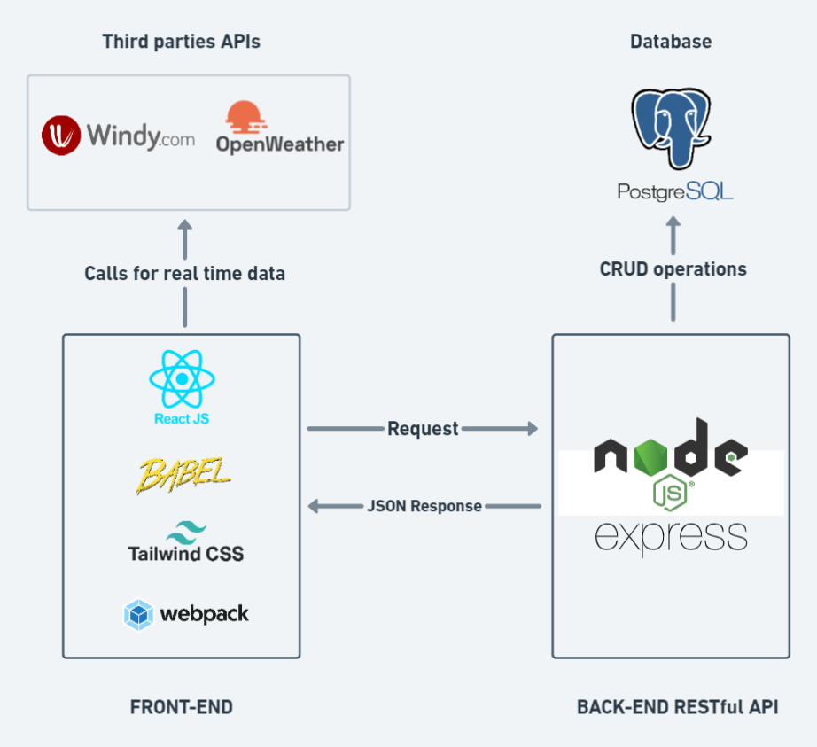
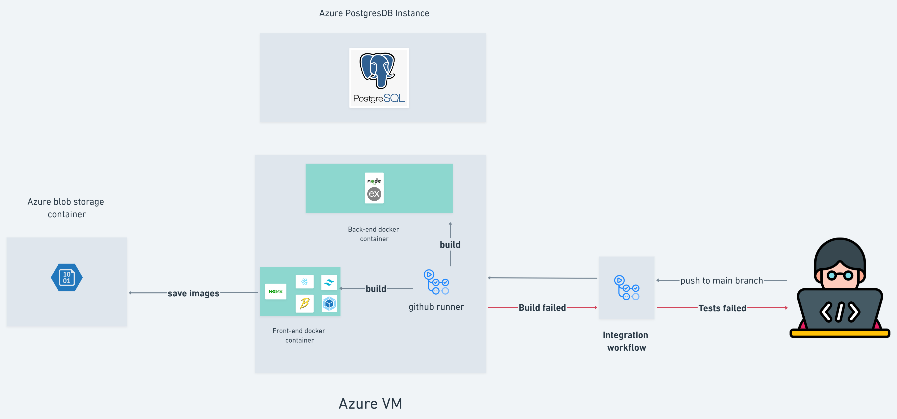

# Introduction 👋

Cabaigne is a web application that help (tourists | local) discover beaches in tunisa.

the goal behind this app is to promote tunisian beaches(because we have awesome ones !!) to people around the world which can support tourism in our country and therefore help locals.

Cabaigne also provides informations about the beach (entertainment options | safety | accessibility ...), real time sea state(calm | agitated | moderate) and weather from [https://api.windy.com/](Windy API) and [https://openweathermap.org/](OpenWeather API)

# let's get technical 👨‍💻

## Tech Stack 🚀

## Back-End ⚙️:

### Dependencies 🔗

View the complete list of Back-End dependencies in the corresponding [package.json](Backend/package.json)

| Tool/Library                                                                       | Version |
| ---------------------------------------------------------------------------------- | ------- |
| [sequelize](https://sequelize.org/)                                                | ^6.21.3 |
| [pg](https://www.npmjs.com/package/pg)                                             | ^8.7.3  |
| [jsonwebtoken](https://www.npmjs.com/package/jsonwebtoken)                         | ^8.5.1  |
| [express](https://expressjs.com/)                                                  | ^4.18.1 |
| [nodemon](https://www.npmjs.com/package/nodemon)                                   | ^4.18.1 |
| [supertest](https://www.npmjs.com/package/supertest)                               | ^1.0.0  |
| [jest](https://jestjs.io/)                                                         | ^3.0.0  |

### routes 🚈

- `/api/v1/beach/allbeaches`: extract all added with corresponding posts(eager loading) from database.
- `/api/v1/posts/allposts`:   extract all posts with corresponding user(eager loading) from database.
- `/api/v1/beach/newbeach`:   add new beach to database(only accessible by admins)
- `/api/v1/uploads/azureblopuploaduser`: add upload azure image url to the corresponding user row.
- `/api/v1/uploads/azureblopuploadbeach`: add upload beach image url to the corresponding user row.
- `/api/v1/user/allpinnedbeaches/:id`:  extract all beaches pinned by `:id`.
- `/api/v1/auth/login`: verify user creds and return a signed jwt token.

## Front-End 🌐:

The backend server and RESTFul API are written with expressjs. the database is postgresql and to communicate between them we use
Sequelize ORM.

We use JWT token for authentication

### Dependencies 🔗

View the complete list of Front-End dependencies in the corresponding [package.json](Frontend/package.json)

| Tool/Library                                                                       | Version |
| ---------------------------------------------------------------------------------- | ------- |
| [react](https://reactjs.org/)                                                      | ^18.2.0 |
| [react-router-dom](https://v5.reactrouter.com/)                                    | ^6.3.0  |
| [swiper](https://swiperjs.com/react)                                               | ^8.3.2  |
| [jwt-decode](https://www.npmjs.com/package/jwt-decode)                             | ^3.1.2  |
| [@azure/storage-blob](https://www.npmjs.com/package/@azure/storage-blob)           | ^12.11.0|
| [@emailjs/browser](https://www.npmjs.com/package/@emailjs/browser)                 | ^3.6.2  |
| [axios](https://axios-http.com/)                                                   | ^0.27.2 |
| [webpack](https://webpack.js.org/)                                                 | ^5.74.0 |
| [tailwindcss](https://tailwindcss.com/)                                            | ^3.1.8  |

### routes 🚈

- `/login`: a basic login page created with tailwind
- `/signup`: basic signup page (email, username, password) signups
- `/profile`: Profile modification page (update user data data and upload profile image)
- `/newbeach`: page to add new beach (only accessible by admin users).

## Cloud Deployment ☁

### Deployment Tools 🛠️:

`github actions`: for our **CI/CD** pipeline we decided to go with github actions to automate the build, test and deployment process by writing workflows with `yaml` syntax in a `.github` folder inside the repo.

find backend tests workflow here [workflows](.github/workflows/integrate_backend.yml)
find deployment workflow here [workflows](.github/workflows/deployment-stage.yml)

`Azure blobstorage container`: out first option was to sotre all images on the filesystem but as we rebuild the docker images on each changes we decided to use azure blob storage to keep the data in separate place. It was a better choice as it separates the storage from the main server and by that out data will be secure in cases like server crashes or data loss.

`Azure PostgreSQL instance`: with the same mindset of separating the code from data, we decided to spin up a dedicated azure postgreSQL instance and link it to our main server. Doing this will distribute the load on two servers. One server will handle all the application processes - web interface and the Database server will handle all the database queries.

`Nginx`: as react built-in server is not suitable for production apps we use nginx web server. Nginx will manage all the requests and will pass it to the **application server** that is connected with a database server.

`Docker`: 